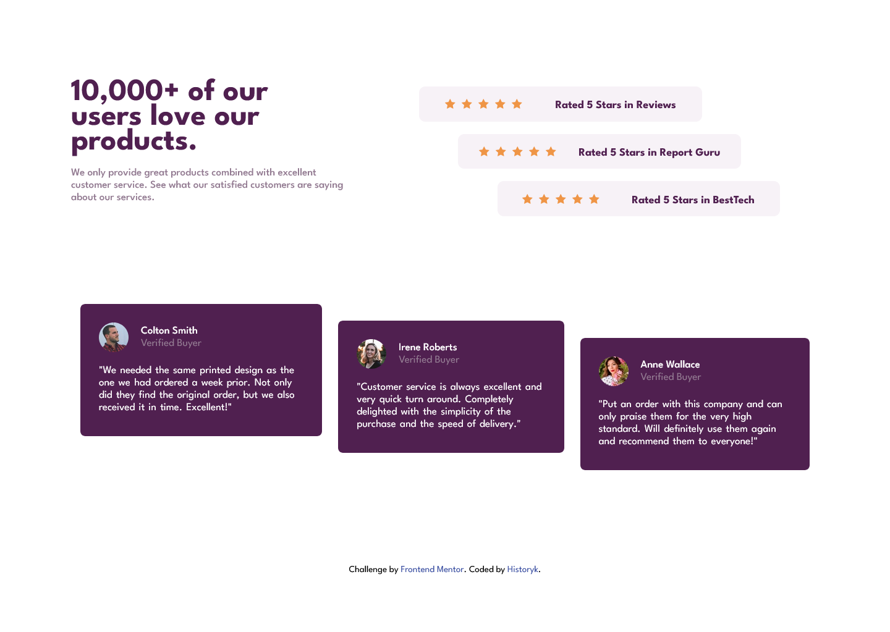

# Frontend Mentor - Social proof section solution

This is a solution to the [Social proof section challenge on Frontend Mentor](https://www.frontendmentor.io/challenges/social-proof-section-6e0qTv_bA). Frontend Mentor challenges help you improve your coding skills by building realistic projects.

## Table of contents

- [Overview](#overview)
  - [Screenshot](#screenshot)
  - [Links](#links)
- [My process](#my-process)
  - [Built with](#built-with)
  - [What I learned](#what-i-learned)
- [Author](#author)

## Overview

A small project I did when I was revisiting HTML and CSS materials.

### Screenshot

### Links

- Solution URL: [Click](https://www.frontendmentor.io/challenges/social-proof-section-6e0qTv_bA/hub)
- Live Site URL: [Click](https://bazankamil.github.io/FrontendMentor/FrontendMentor-4-Social-proof-section-master/)

### Built with

- Semantic HTML5 markup
- Flexbox
- CSS Grid
- Mobile-first workflow
- SASS

### What I learned

Simple revisiting HTML, CSS and SASS

## Author

- Website - [HistorykProgramista](https://github.com/bazankamil)
- Frontend Mentor - [HistorykProgramista](https://www.frontendmentor.io/profile/bazankamil)
- Twitter - [HistorykProgramista](https://www.twitter.com/HistProgramista)
