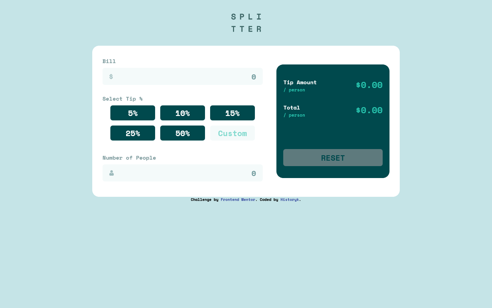
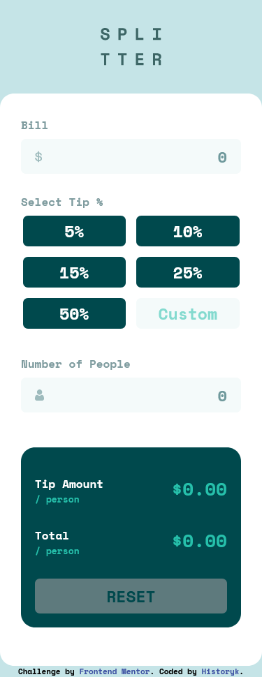

# Frontend Mentor - Tip calculator app solution

This is a solution to the [Tip calculator app challenge on Frontend Mentor](https://www.frontendmentor.io/challenges/tip-calculator-app-ugJNGbJUX). Frontend Mentor challenges help you improve your coding skills by building realistic projects.

## Table of contents

- [Overview](#overview)
  - [Screenshot](#screenshot)
  - [Links](#links)
- [My process](#my-process)
  - [Built with](#built-with)
  - [What I learned](#what-i-learned)
- [Author](#author)

## Overview

A small project in JS (technically in TS) This was the project that startet my "project-oriented learning"

### Screenshot

### Links

- Solution URL: [Add solution URL here](https://your-solution-url.com)
- Live Site URL: [Add live site URL here](https://your-live-site-url.com)

### Built with

- Semantic HTML5 markup
- Flexbox
- CSS Grid
- Mobile-first workflow
- SASS
- JS

### What I learned

The first JS project - was more difficult than I expected. This project completely changed my learning habits. From now on, I will focus on project-oriented learning.

## Author

- Website - [HistorykProgramista](https://github.com/bazankamil)
- Frontend Mentor - [HistorykProgramista](https://www.frontendmentor.io/profile/bazankamil)
- Twitter - [HistorykProgramista](https://www.twitter.com/HistProgramista)
