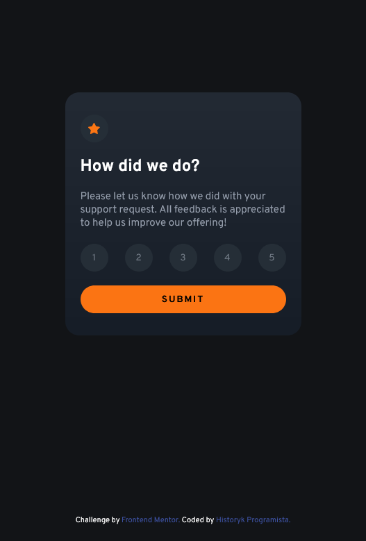
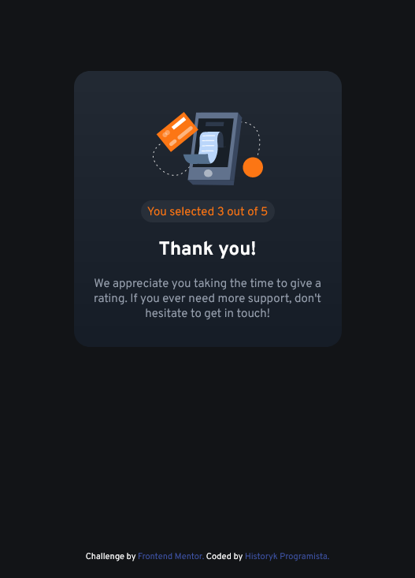

# Frontend Mentor - Interactive rating component solution

This is a solution to the [Interactive rating component challenge on Frontend Mentor](https://www.frontendmentor.io/challenges/interactive-rating-component-koxpeBUmI). Frontend Mentor challenges help you improve your coding skills by building realistic projects.

## Table of contents

- [Overview](#overview)
  - [Screenshot](#screenshot)
  - [Links](#links)
- [My process](#my-process)
  - [Built with](#built-with)
  - [What I learned](#what-i-learned)
- [Author](#author)

## Overview

### The challenge

Users should be able to:

- View the optimal layout for the app depending on their device's screen size
- See hover states for all interactive elements on the page
- Select and submit a number rating
- See the "Thank you" card state after submitting a rating

### Screenshot

### Links

- Solution URL: [Click](https://www.frontendmentor.io/challenges/interactive-rating-component-koxpeBUmI/hub)
- Live Site URL: [Click](https://bazankamil.github.io/FrontendMentor/FrontendMentor-6-Interactive-rating-component/)

### Built with

- Semantic HTML5 markup
- SASS
- JS

### What I learned

Very simple project for training with querySelectors and eventListeners.

## Author

- Website - [HistorykProgramista](https://github.com/bazankamil)
- Frontend Mentor - [HistorykProgramista](https://www.frontendmentor.io/profile/bazankamil)
- Twitter - [HistorykProgramista](https://www.twitter.com/HistProgramista)
